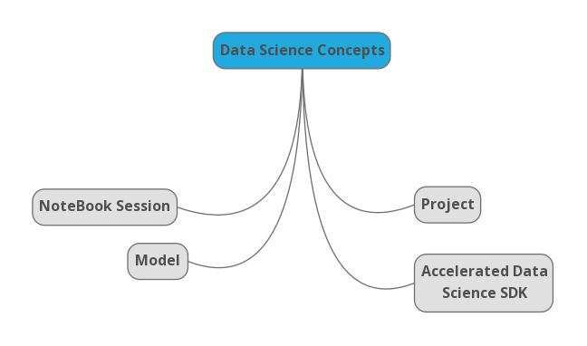

# Chapter: Prateek Shaw sp20-516-229

## Oracle Cloud Data Science Platform : Oracle

Data Science is a platform for data scientists to build, train, and manage models on Oracle Cloud Infrastructure using Python and open source machine learning libraries.It also offers below Oracle ML product.Using this platform team can collaborate and developer machine learning models.

* Oracle Labs Auto ML
* Model Explanation Tools
* Notebook
* Oracle Accelerated Data Science SDK

The main features of this platform are below.

1. Infrastructure and Data science tools
1. Collaborative and Project-Driven workspace

This platform is launched on 02-12-2020 [@oracle-cloud-data-science-platform-sp20-516-229] .

Below are steps which we need to follow to evaluate Oracle AI Data Science offering

### Create Oracle Free Tier Account 

Oracle Cloud Free Tier allows you to sign up for an Oracle Cloud account which provides a number of Always Free services and a Free Trial with US$300 of free credit to use on all eligible Oracle Cloud Infrastructure services for up to 30 days. The Always Free services are available for an unlimited period of time. The Free Trial services may be used until your US$300 of free credits are consumed or the 30 days has expired, whichever comes first. Check @fig:sp20-516-229-oracle-free-tier-1 and @fig:sp20-516-229-oracle-free-tier-2 images for more details.

Please remember 300$ is enough to evaluate Data Science service.

{#fig:sp20-516-229-oracle-free-tier-1}

{#fig:sp20-516-229-oracle-free-tier-2}

### Understadning Data Science Platform Concepts 

The first step is to undestand basic conectps of this platform. Please see [@fig:sp20-516-229-oracle-data-science-concepts] for more information

{#fig:ssp20-516-229-oracle-data-science-concepts}

#### Project

Project that holds all the data science assets which include notebook sessions and models.

#### NoteBook Session

Notebook sessions is same as jupyter notebook but this also includes oracle developed machine learning and data science packages.It comes with lab.

#### Accelerated Data Science (ADS) SDK

This is very important and enhanced feature which provides full life cycle support for machine learning application.

#### Model

This is place to store ,track , share and manage models.

### Configure Tenancy for Data Science

Before accessing data scince service, we need to complete below configurations.

#### Create User, Groups and assigning group to user

##### User

Go to Governance and Administraction , identity and click on User.

##### Group

Go to Governance and Administraction , identity and click on Group.

##### Assign Group to User

Go to Governance and Administraction , identity and click on User

#### Create Compartments to Own Network and DS resources

##### What is compartments ?

Compartments are the primary building blocks you use to organize your cloud resources. You use compartments to organize and isolate your resources to make it easier to manage and secure access to them.
<https://docs.cloud.oracle.com/en-us/iaas/Content/GSG/Concepts/settinguptenancy.htm>

##### Compartment creation

Go to Governance and Administraction , identity and click on Compartment

##### Creations of VCN and Subnets

###### Create Virtual Cloud Network

Go to Core Infrastructure , Networking, Virtual Cloud Networks and click on Create Virtual Cloud Netwrok Button.

Select correct compartment.

###### Create Subnets in VCN

Go to Core Infrastructure , Networking, Virtual Cloud Networks and click on your VCN. Make sure you are in right compartment else you will not see VCN.

Click on Create subnet

#### Create Policies to control Network and DS resources

