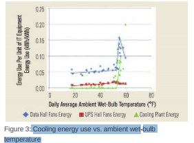
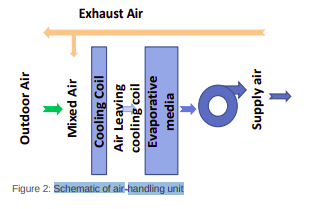

# Datacenter: Prateek Shaw sp20-516-229

## E.Datacenter.3: Your own Carbon footprint

19 tons CO2eq/year  Which is 57 % Better than Average

## E.Datacenter.4

### Renewal Energy - Thermal 

Thermal energy is a kind of energy that is related to the temperature of matters and also called heat energy. The energy which comes from heated matters is called thermal energy.

Data centers are producing a lot of heat from IT equipment and the cooling system is the second-largest consumer in a data center after the Information Technology (IT) equipments.Geothermal energy can be used for heating and cooling purposes for data centers.

Below are some of examples  

* [American College Testing(Iowa)](https://www.datacenterknowledge.com/archives/2009/08/13/geothermal-data-center-is-leed-platinum)    
* [Prairie Bunkers, LLC(Nebraska)](https://www.datacenterknowledge.com/archives/2009/08/25/prairie-bunkers-pursues-geothermal-cooling/)  
* [Verne Global(Iceland)](https://www.datacenterknowledge.com/archives/2010/01/18/iceland-gets-major-data-center-project/)   

## E.Datacenter.5

Below are examples of companies that renew waste heat.

IBM: The hot air generated by the Uitikon center will flow through heat exchangers to warm water that will be pumped into the nearby pool. The town covered the cost of some of the connecting equipment but will get to use the heat for free. [@ibm-waste-heat-sp20-516-229] IBM has mentioned that waste heat is enough to warm 80 homes or one swimming pool.

Oracle: Oracle is recycling waste heat base on the environment where its data center located. The data center in West Jordan, Utah uses waste heat from the IT equipment for space humidification in the winter, evaporative cooling in summer, and reduced primary airflow to the IT equipment.The system uses the waste heat from the IT equipment to evaporate water into moisture instead of using additional energy to generate steam. 

The hot air from the IT equipment—mixed with cold and dry outside air—flows over a wet media where it picks up moisture and gets humidified as shown @fig:sp20-516-229-oracle-1 and @fig:sp20-516-229-oracle-2.

{#fig:sp20-516-229-oracle-1}

{#fig:sp20-516-229-oracle-2}

## E.Datacenter.8

The biggest risk of the data center is power outages. According to the Ponemon Institute LLC study(2016), the average cost of a data center outage has steadily increased from $505,502 in 2010 to $740,357.

The delta airline canceled about 1,000 flights on the day of the outage and also ground an additional 1,000 flights over the following two days [@delta-outage-sp20-516-229] .And also it agreed to give refunds.

Delta shares were down 0.6 percent due to this outage [@delta-share-sp20-516-229] .

Below is Delta airline power outages details.

| Key              | Value |
| ------------------- | ------- | 
| Date  | August 08 2016 2:30 AM ET  |
| Datacenter | Delta |
| Category | Power Outrage |
| Description | lost power at its operations center in Atlanta |
| Duration | 2 days |
| Impact | large |
| Cost impact | >$150 million |

## Citation 

1. [Ponemon Institute 2016-cost-of-data-center-outages](https://www.vertiv.com/globalassets/documents/reports/2016-cost-of-data-center-outages-11-11_51190_1.pdf)  
1. [Oracle Data Center](http://www.oracle.com/us/products/applications/green/innovation-data-center-2394061.pdf)  
1. [Delta data center outage cost](https://money.cnn.com/2016/09/07/technology/delta-computer-outage-cost/)   
1. [Data-center-used-to-heat-swimming-pool](https://www.datacenterknowledge.com/archives/2008/04/02/data-center-used-to-heat-swimming-pool)    
1. [Geothermal-data-centers ](https://www.datacenterknowledge.com/geothermal-data-centers)    
1. [Geothermal](https://www.irena.org/geothermal)    
1. [Oracle operations](https://www.oracle.com/corporate/citizenship/sustainability/operations.html)    
